# Cursor

 
 

setup

    pyenv install 3.9.0
    pyenv virtualenv 3.9.0 cursor
    pyenv activate cursor
    pip install -r requirements.txt
    git submodule update --init

test
    
    # linux/osx
    py.test --cov cursor -v
    flake8 --max-line-length=100 --ignore=E402,W503
    
    # single test
    pytest tests/test_renderer.py::test_ascii_renderer

    # windows
    python -m pytest --cov=cursor . -v

recorder

    # check scripts folder
    pip install -e .
    cursor_recorder

experiment

    pip install -e .
    cd experiments
    python file.py
    
data handling

    # remove recording files with <3kb in file size
    cd data/recordings
    find . -name "*.json" -type 'f' -size -3k -delete

###Plotter handling

hard limits of the plotting area as measured by the machine, in plotter steps

    OH;
    >> -15819, -9298, 15819, 9298
    >> 1mm = 40 steps
    >> your width is 15819 + 15819 / 40 = 790mm
    >> do the same with the height
    
    the plotter drawing are will have +25mm offset at the bottom
    
inkscape

    create document with  that dimensions
    bottom (right) side has 25mm offset
    in order to have everwhere the same offset (30mm) add 25mm offset left, right and top in inkscape
    
    you can use the inkscape plot function.
    serial flow: Hardware RTS/CTS
    center zero point (on big hp plotter)
    change pen speed, default is full speed
    plot featuer: everything off (overcut: 0mm; offset correction: 0mm; precut and autoalign off)

plotters

HP Draftmaster SX/HP7595A,
HP7475A,
Roland DG DXY-980,
Roland DG DXY-990,
Roland DG DXY-885,
Roland DG DXY-1200,
Tektronix 4662,
Aritma 512,
Roland DG DPX3300,
Roland DG CAMM-1 PNC-1000,
A0 DIY

HPGL Basics

    IN; Init
    PA;PD;PU;
    SP: Select Pen

    FS[1-16]: Pen Force (20-125g) (DPX3300)
    1, 2, 3, 4, 5, 6, 7, 8, 9, 10,11,12,13, 14, 15, 16
    20,20,35,35,50,50,65,65,80,80,95,59,110,110,125,125
    
    LB,LO: Label, LabenOrigin

    VS: Velocity/Speed (2-45 cm/s)
    When the automatic pen control mode is OFF ("AUTO" LED is OFF), pen speed is
    set to the command value. But when the automatic pen control is ON ("AUTO" LED
    lights ON), you cannot change pen speed by the VS command.

    PT: Pen Thickness (0.1 - 5.0)
    When you select a filling pattern by the FT command (FT1, FT2), the setting by this command is effective. 
    The PT command is effective only to the currently used pen. 

    LT: LineType
    RR/RA: RectRelative/RectAbsolute
    FT: The FT command specifies the pattern of filling or hatching. It is used together with the RA, RR and WG commands.

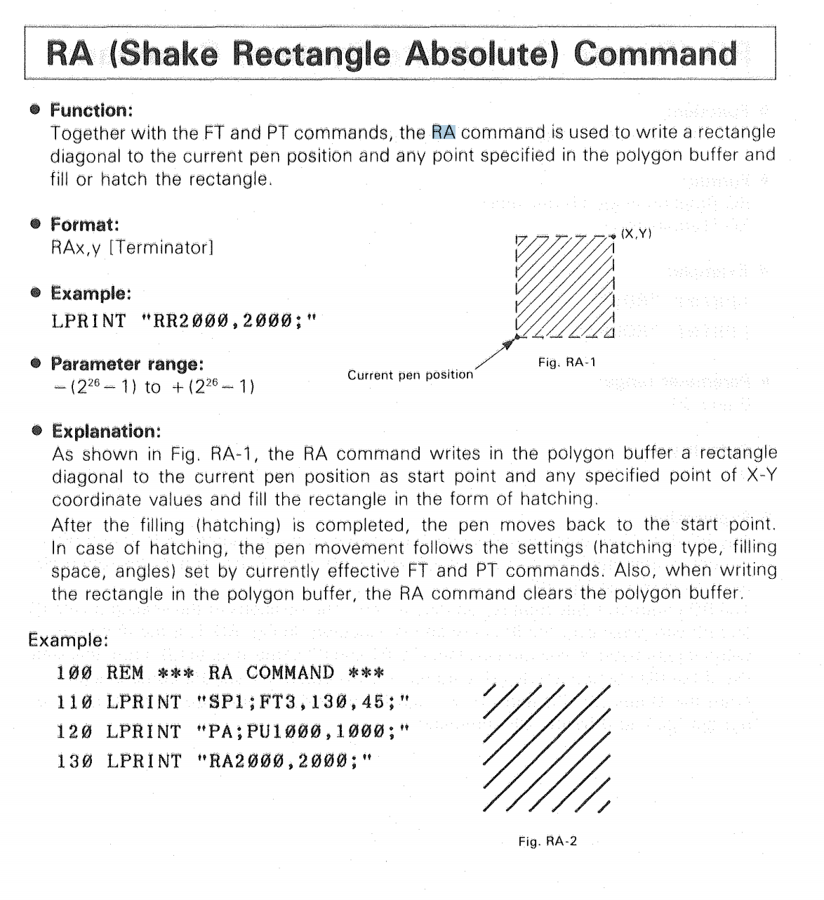
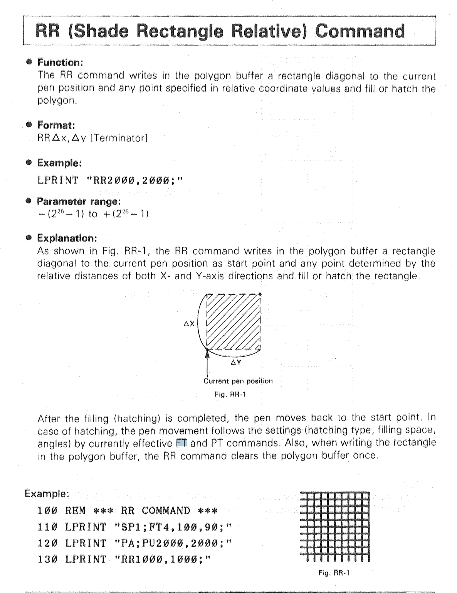
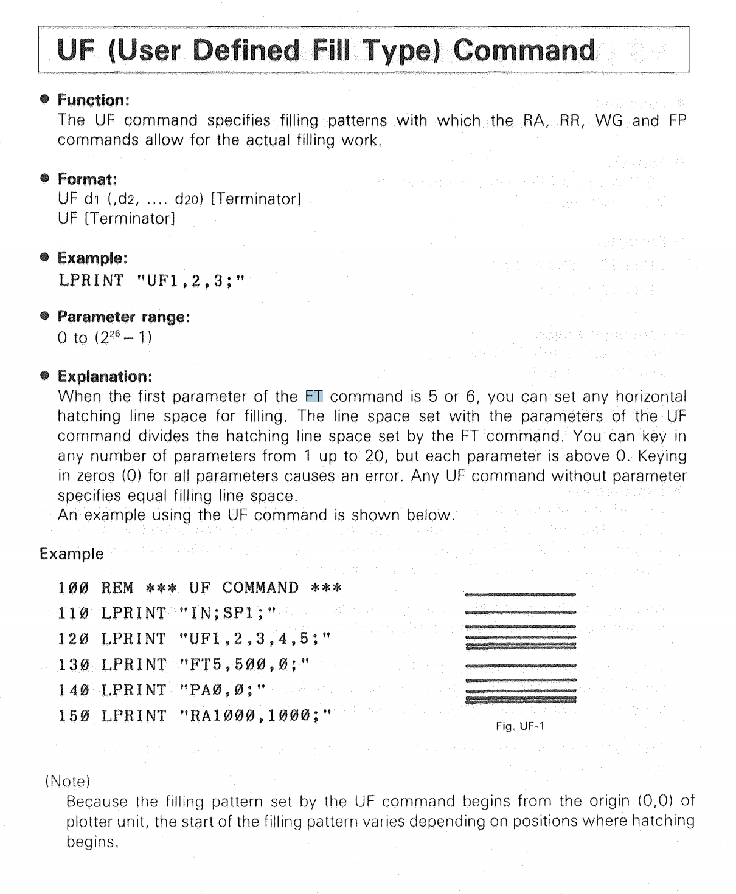
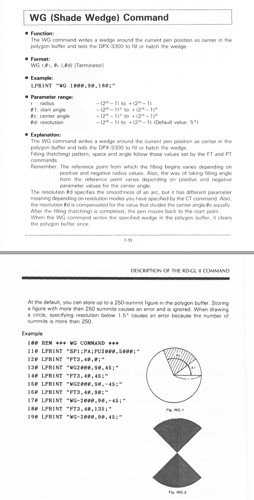

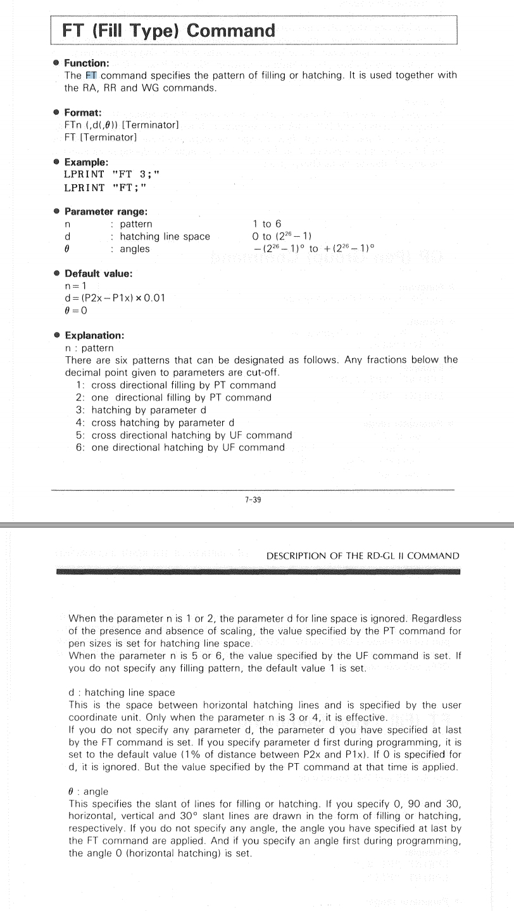

## 4662 Tektronix
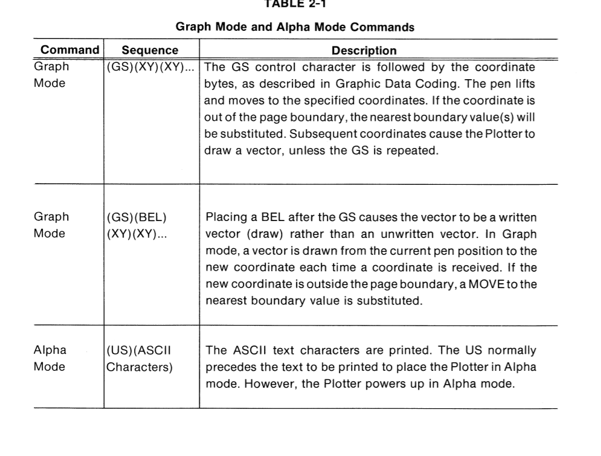
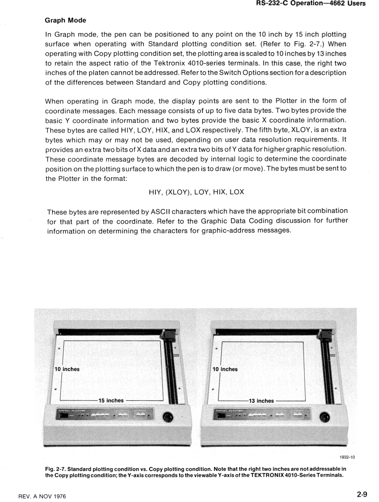
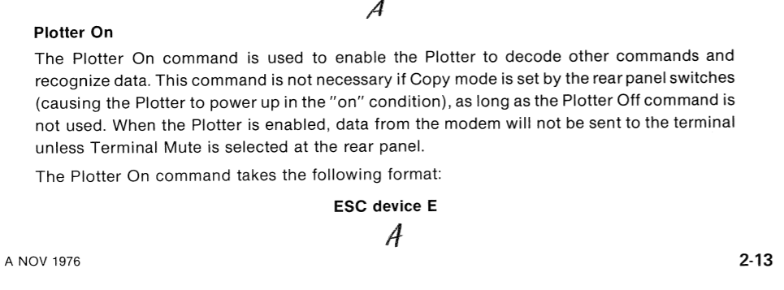
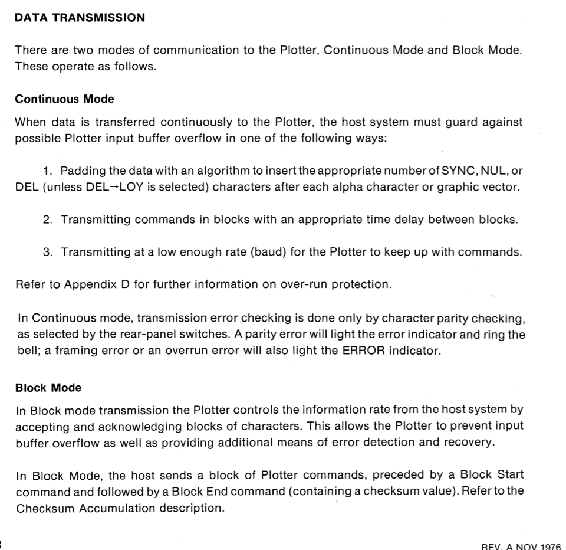
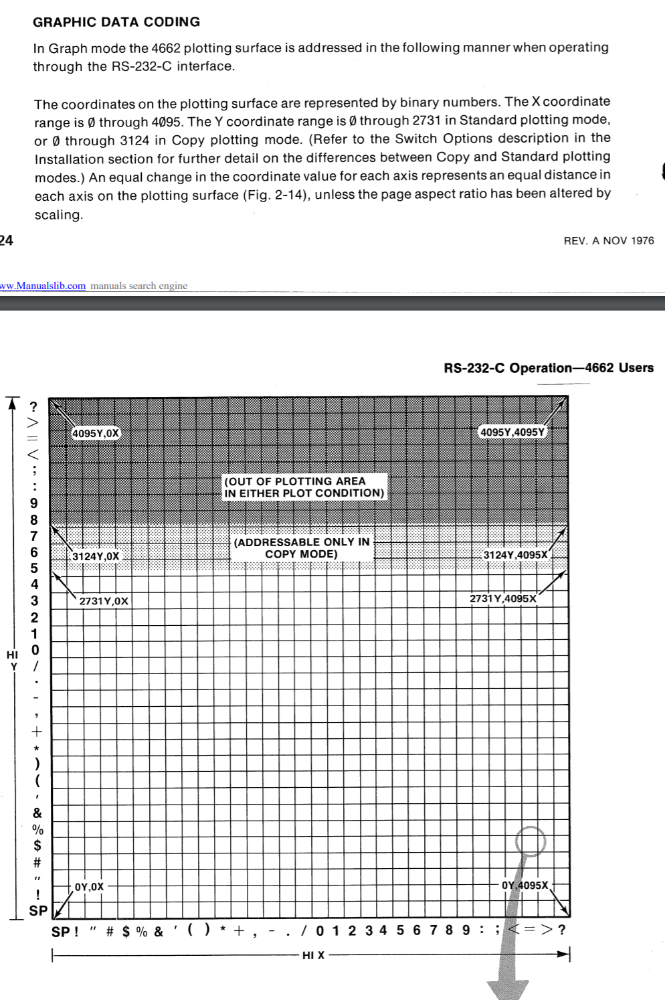
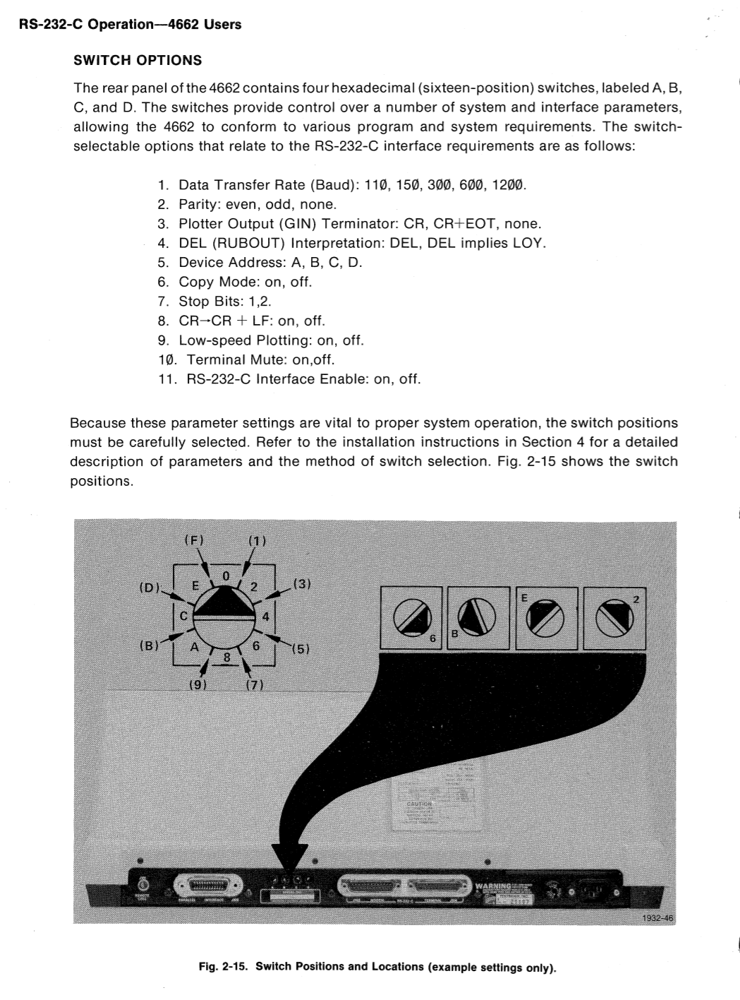

Ink Tips

    1. 1x 2.0mm
    2. 2x 1.4mm 

https://github.com/beardicus/awesome-plotters#manuals-and-ephemera

##### HP7595A
    - serial cable with usb adapter
    - ohne nullmodem
    - sendhpgl port file
    - inkscape hpgl export check "centerd"

##### HP7475A
    - serial cable with usb adapter
    - mit nullmodem
    - sendhpgl port file
    - https://github.com/b4ckspace/hpgl-plot

##### HP7475A buffer overflow
    - serial cable with usb adapter
    - mit null modem
    - cat file to port

#### HP7475A inkscape
    - document layout: A3 in landscape 
    - export hpgl not centered

#### Roland CAMM-1
    - usb to parallel port adapter
    - chmod 777 /dev/usb/lp0
    - cat file.hpgl /dev/usb/lp0

#### HP7475a GPIB HPIB
    https://pearl-hifi.com/06_Lit_Archive/15_Mfrs_Publications/20_HP_Agilent/HP_7475A_Plotter/HP_7475A_Op_Interconnect.pdf
    - Prologix GPIB Configurator
    - Auf ID 5
    - Arduino Serial Monitor, "help++"
    http://prologix.biz/downloads/PrologixGpibUsbManual-6.0.pdf

##### Roland DPX3300
usb to parallel port adapter

    chmod 777 /dev/usb/lp0
    cat file.hpgl /dev/usb/lp0
