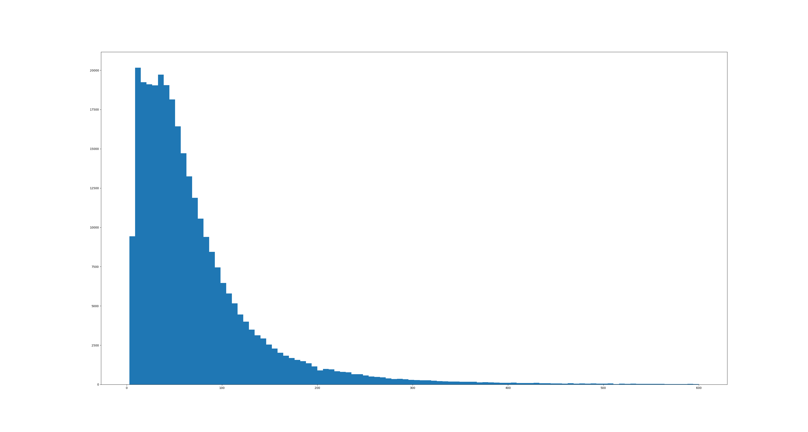
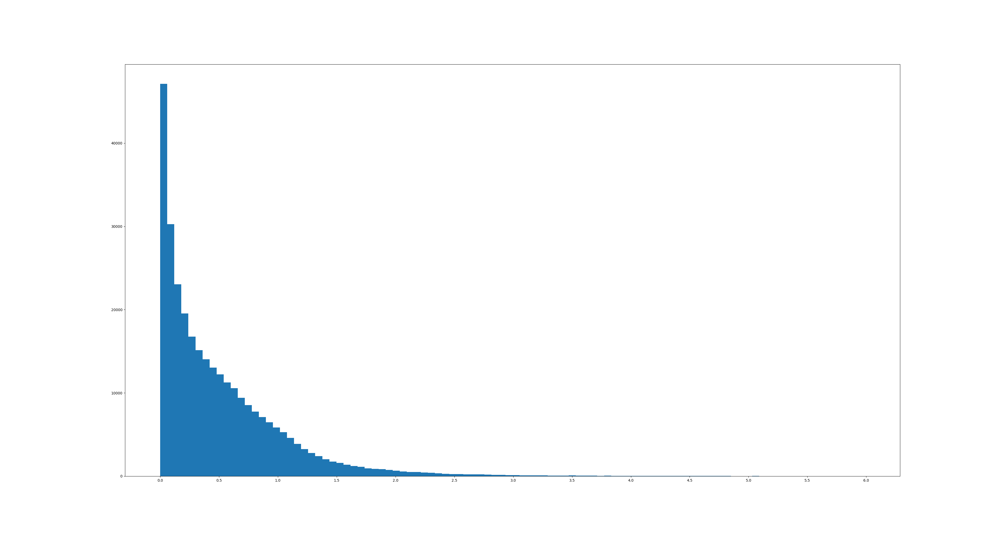
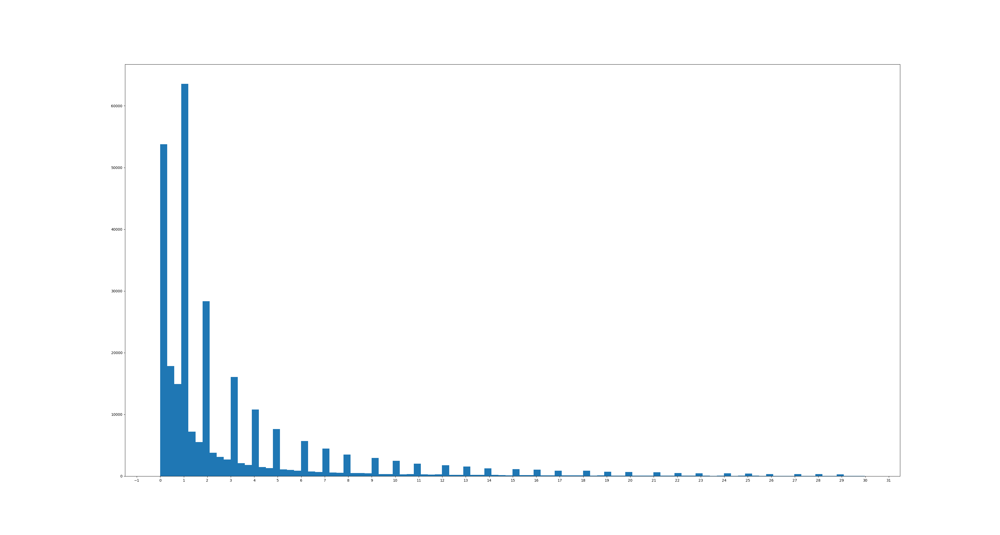
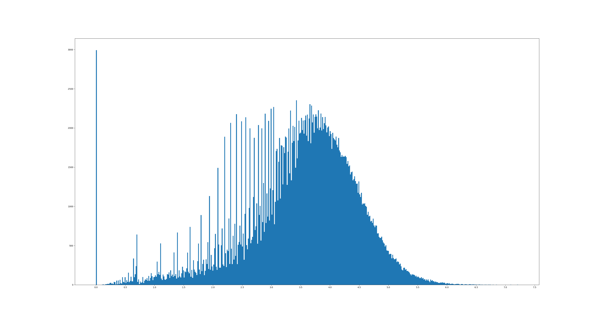
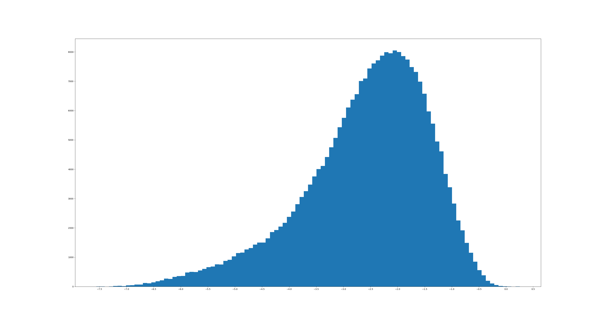
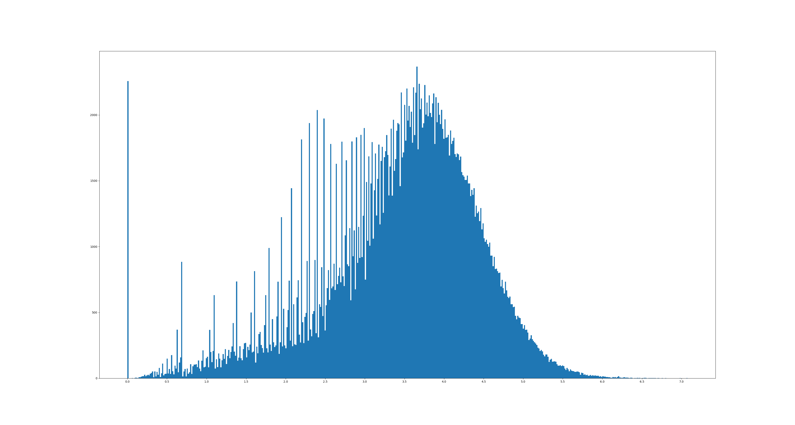
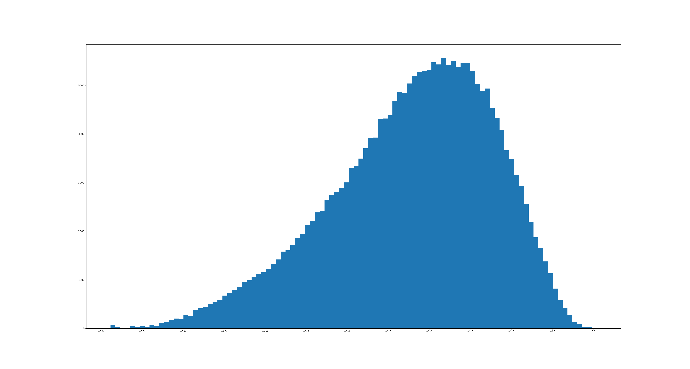
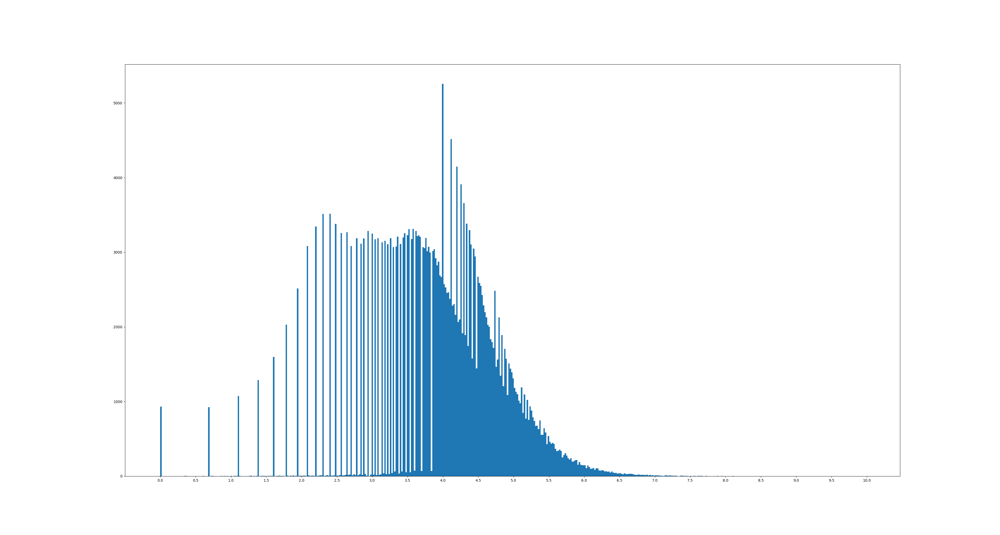
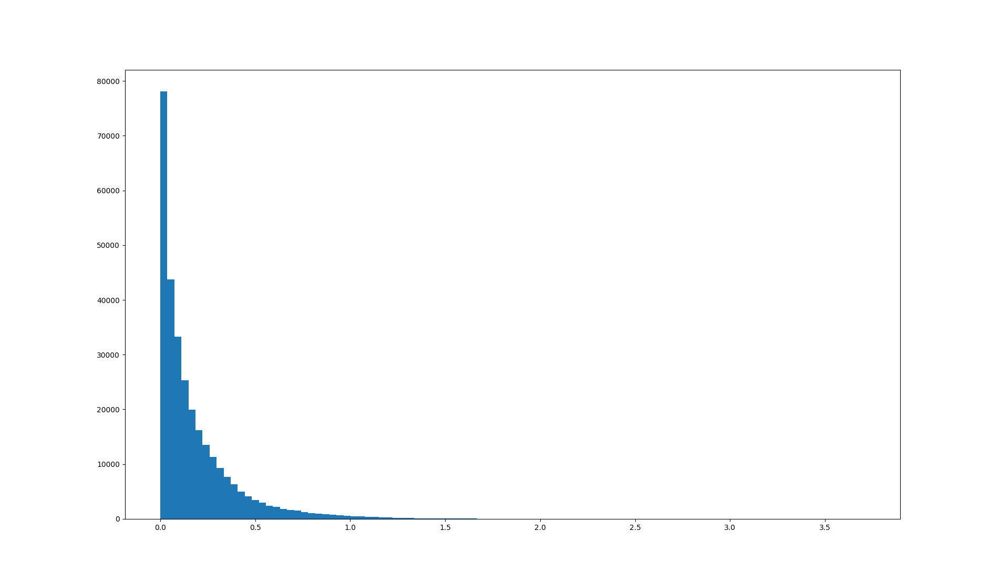
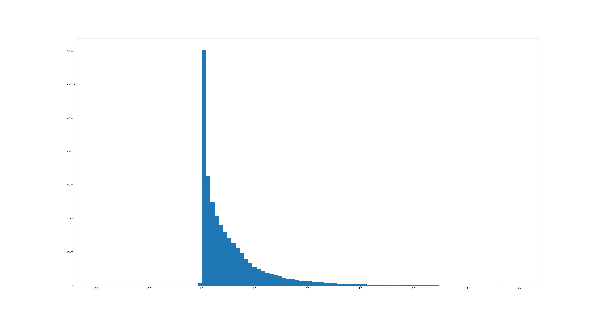

Notes
-----

Length, how many points

Distance normalized absolute

Distance normalized relative (divided by length)

Duration in s (discarded all above 30s)

Measurements
------------

Entropy X

Differential Entropy X

Entropy Y

Differential Entropy Y

Entropy Direction Change

Variation X

Variation Y

About 2% of all paths are 1-dimensional either in x- or y-dimension

    This is how long it takes to load everythin file-by-file
    ℹ Loaded 310224 paths from 116 recordings
    ℹ Loaded 0 keys from 116 recordings
    ℹ This took 76202ms.

    Pickled:
    INFO: Loading 2023.pckl took : 59100ms

When doing direction change entropy calculation, all paths with only 2 vertices are 0

length:

- 2000 paths (1%) are longer than 600 vertices

differential entropy:

- x: INFO: Total 264568 paths // possible to compute (15% impossible. because too few points or -inf entropy)
- y: INFO: Total 227199 paths // 17%

Potential todo

- drop 1-dimensional paths
- export pickles of certain entropy buckets
- drop paths with less than 3 vertices