HPGL Basics

    IN; Init
    PA;PD;PU;
    SP: Select Pen

    FS[1-16]: Pen Force (20-125g) (DPX3300)
    1, 2, 3, 4, 5, 6, 7, 8, 9, 10,11,12,13, 14, 15, 16
    20,20,35,35,50,50,65,65,80,80,95,59,110,110,125,125
    
    LB,LO: Label, LabenOrigin

    VS: Velocity/Speed (2-45 cm/s)
    When the automatic pen control mode is OFF ("AUTO" LED is OFF), pen speed is
    set to the command value. But when the automatic pen control is ON ("AUTO" LED
    lights ON), you cannot change pen speed by the VS command.

    PT: Pen Thickness (0.1 - 5.0)
    When you select a filling pattern by the FT command (FT1, FT2), the setting by this command is effective. 
    The PT command is effective only to the currently used pen. 

    LT: LineType
    RR/RA: RectRelative/RectAbsolute
    FT: The FT command specifies the pattern of filling or hatching. It is used together with the RA, RR and WG commands.

    OF; Output factor, number of plotter units per millimeter per axis
    OI; plotter model!

###Plotter handling

hard limits of the plotting area as measured by the machine, in plotter steps

    OH;
    >> -15819, -9298, 15819, 9298
    >> 1mm = 40 steps
    >> your width is 15819 + 15819 / 40 = 790mm
    >> do the same with the height
    
    the plotter drawing are will have +25mm offset at the bottom
    
inkscape

    create document with  that dimensions
    bottom (right) side has 25mm offset
    in order to have everwhere the same offset (30mm) add 25mm offset left, right and top in inkscape
    
    you can use the inkscape plot function.
    serial flow: Hardware RTS/CTS
    center zero point (on big hp plotter)
    change pen speed, default is full speed
    plot featuer: everything off (overcut: 0mm; offset correction: 0mm; precut and autoalign off)

HPGL professional

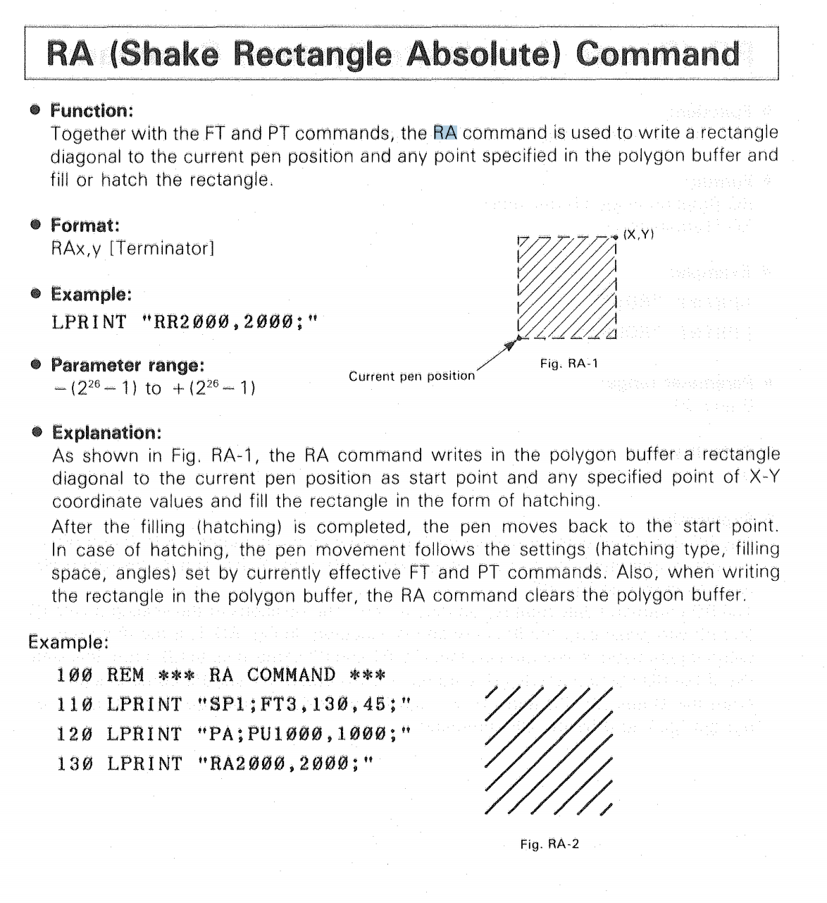
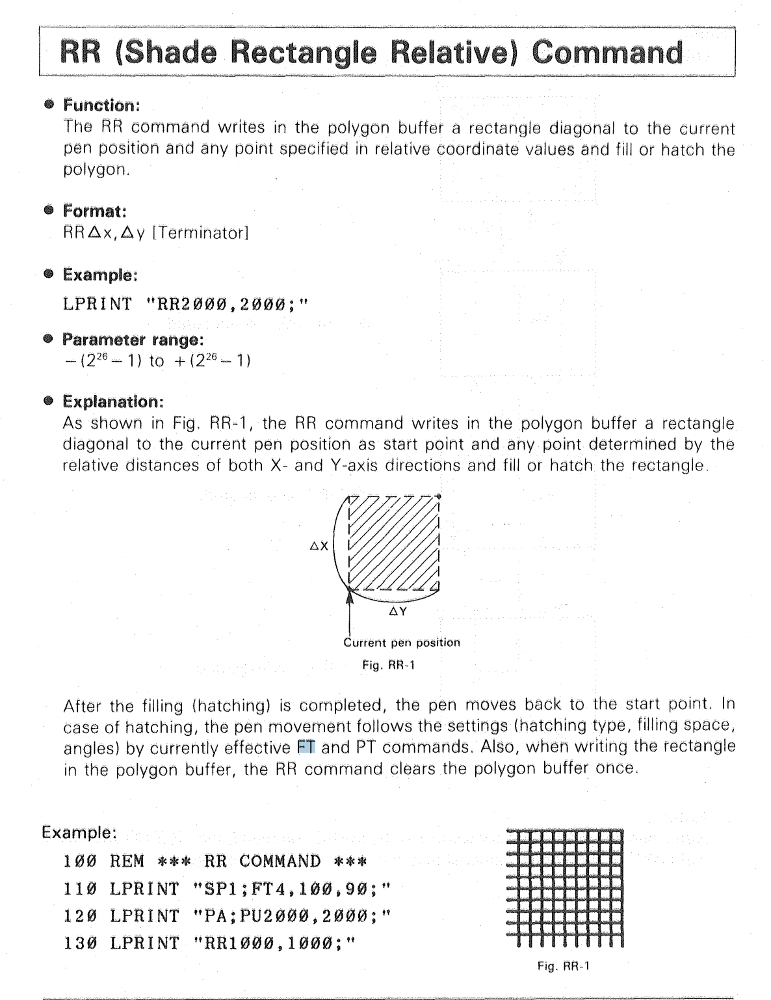
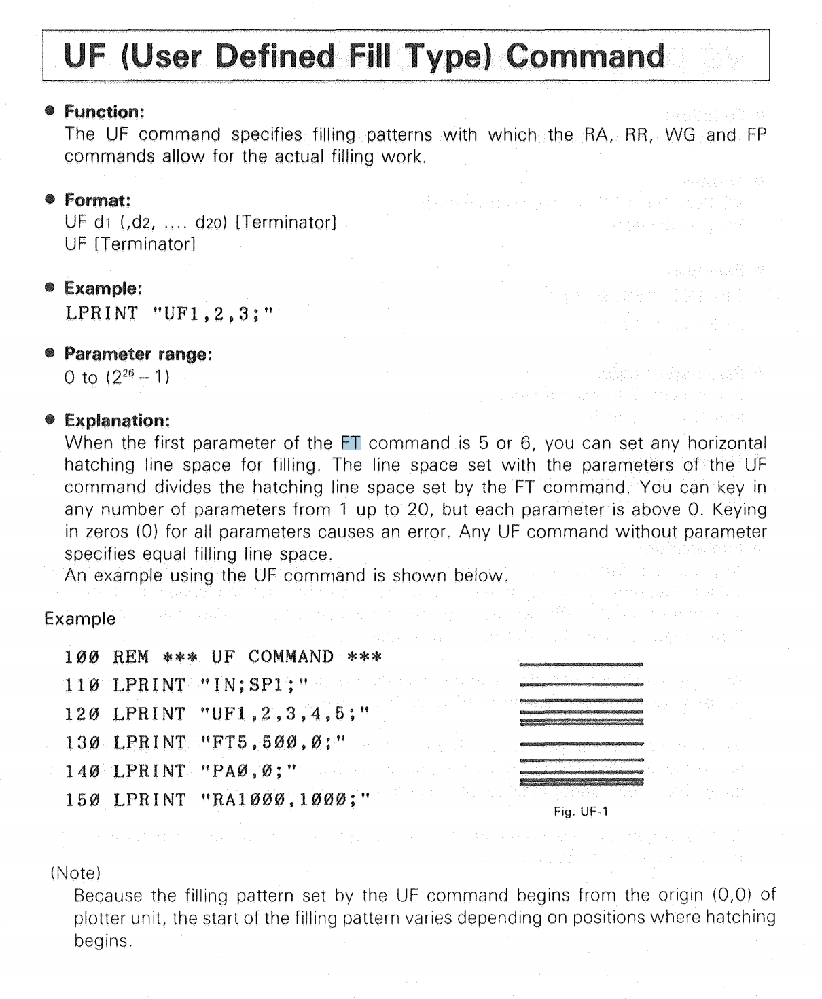
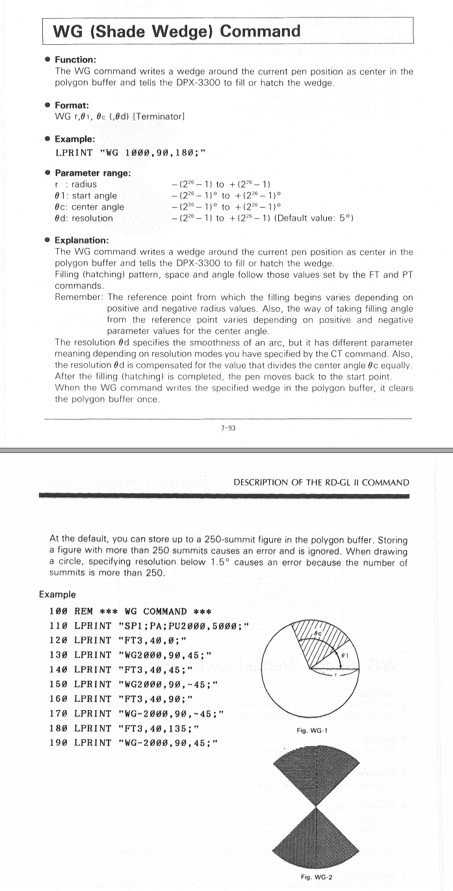
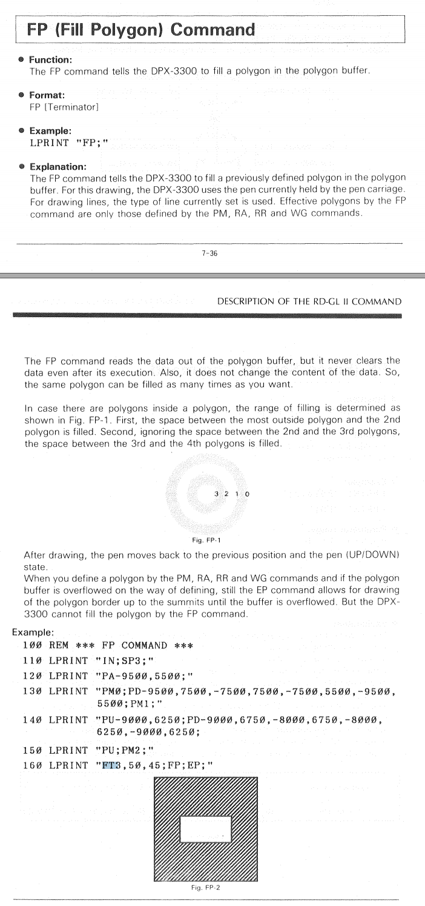
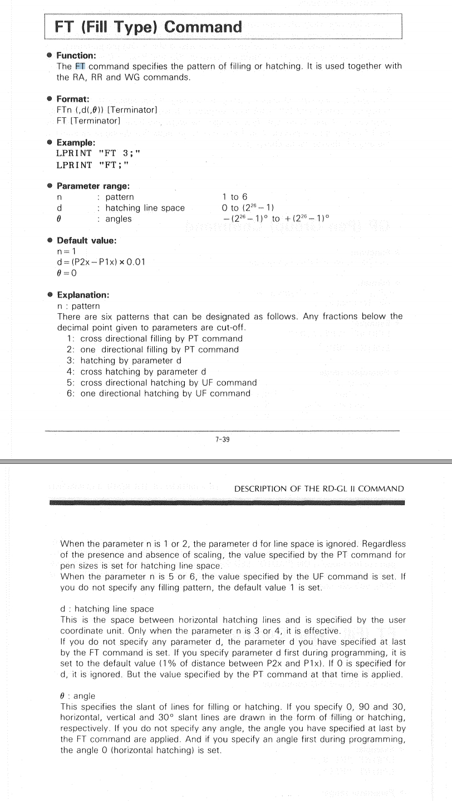

## 4662 Tektronix

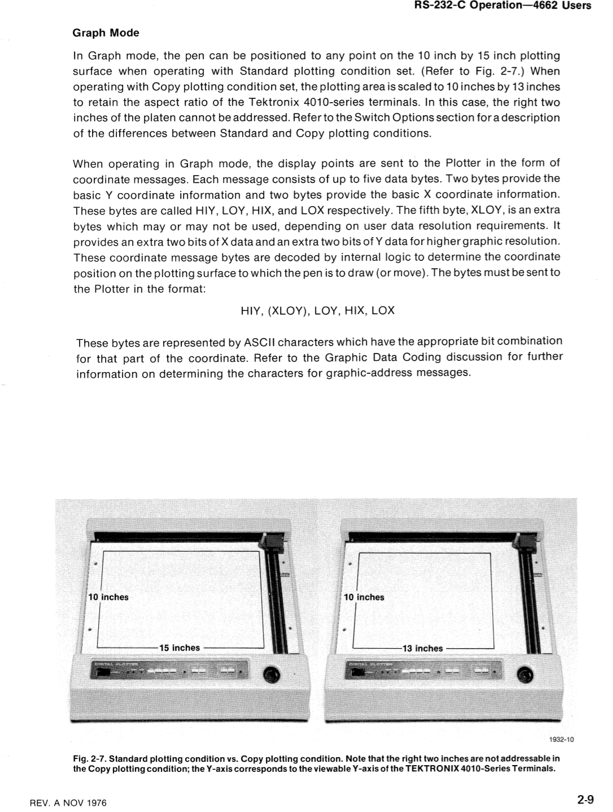
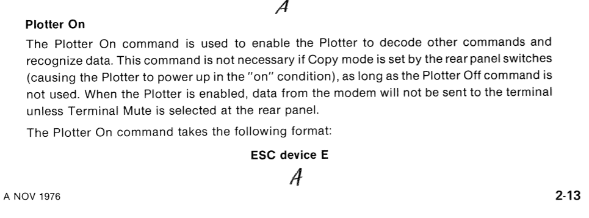
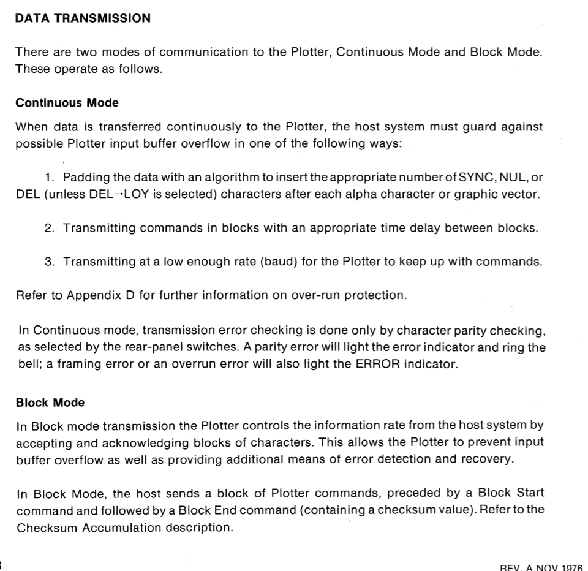
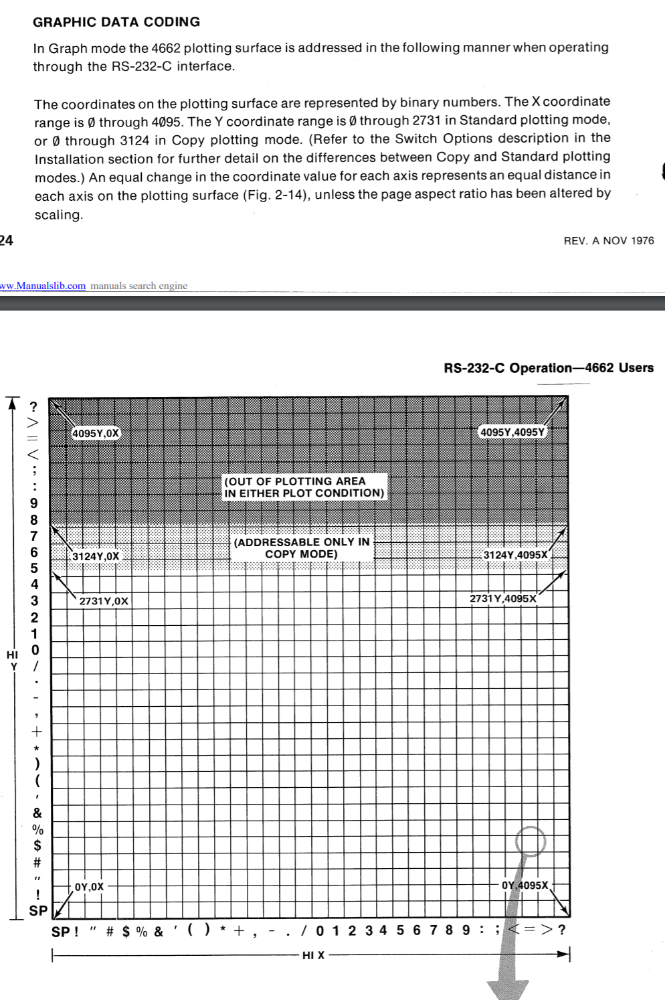
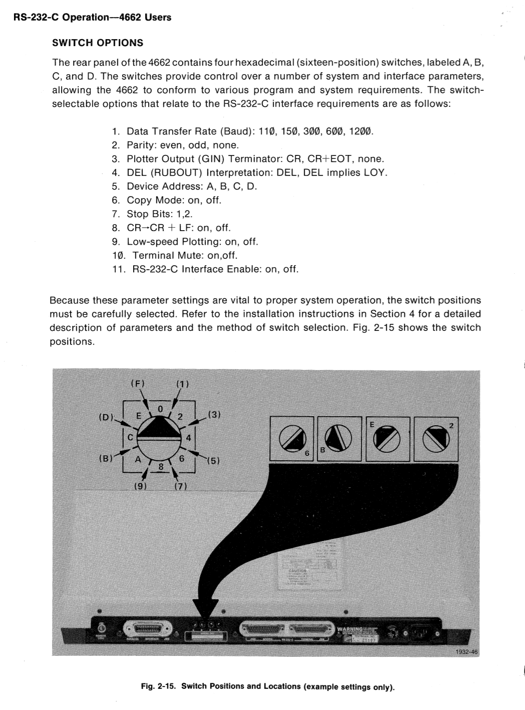

## dpx3300
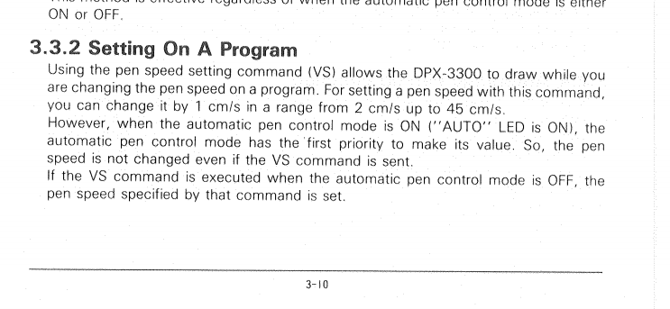
