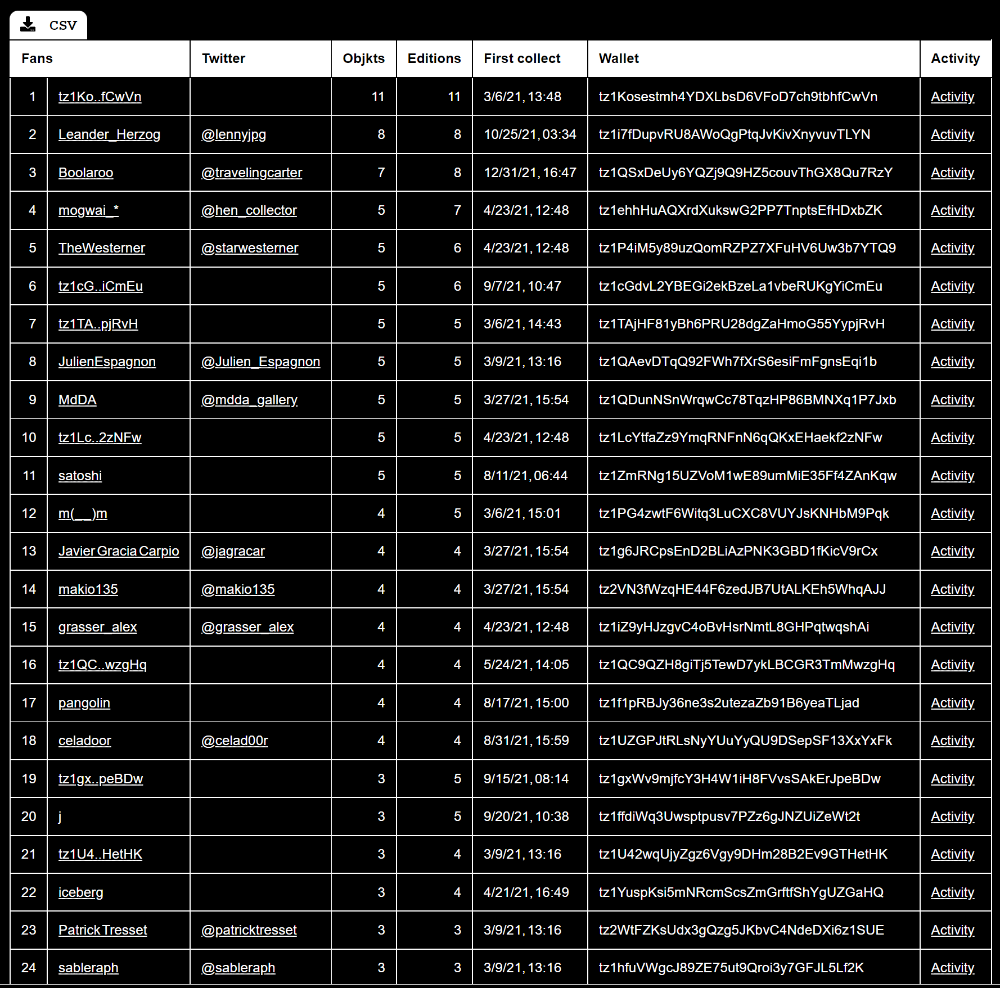

⚫ Genuary 2022

http://genuary.art/prompts

todo
- make a collection on objkt.com called "Genuary 2022"
- make a plot every day, it has to be generative, maybe. or just code art.
- we can already start. ok
- record mouse every day, make at end of month one collection, 1/1

**day 1
draw 10.000 of something**

play with noncentral_chisquare
2 different pens
horizon

homage an vera molnar

**day 2** 
**dithering**

previous images dithered
dither image of source code?

**day 3**
**space**

mscoco dataset!

**jan.4
the next next fidenza**

use meridian by mattdesl instead and try to copy it as good as possible https://twitter.com/mattdesl/status/1475928600146755586?s=21
it combines plotter aesthetics with the background photo i used to have on my iphone. who was the artist?

**jan.5
destroy a square**

make a square of lots of dashes
scramble the positions

or use composition #60

**jan.6
Trade styles with a friend.**
kevin abosh style
use yubikey or tezos wallet addresses

There are 314 collectors (owning at least one edition), including 83 fans (holding at least 2 different tokens) of schwittlick

Objkts : 420 - Editions : 30487

https://nftbiker.xyz/fans?wallet=tz1c3hFmjFSwunjLHECnYyjr42KRt5YiHrGX

We are not friends, yet, but I started the trade with @kevinabosch. Some special (to me) #tezos wallet hashes. The top 80 collectors of my work. 

**jan.7
Sol LeWitt Wall Drawing.**

**jan.8
Single curve only.**

get most complex curve
draw it fat

**jan.9
Architecture.**

proof of work
this took 5:34m to compute
architecture of proof of work

jan.10
Machine learning, wrong answers only.

jan.11
No computer.

jan.12
Packing (squares, circles, any shape…)

jan.13
80x800

**jan.14
Something you’d never make.**

andreas gysin tower bootleg

**jan.15
Sand**
fällt mir gar nichts ein, yawn.

jan.16
Color gradients gone wrong

jan.17
3 colors

jan.18
VHS

jan.19
Use text/typography

jan.20
Make a sea of shapes

jan.21
Combine two (or more) of your pieces from previous days to make a new piece.

jan.22
Make something that will look completely different in a year.

jan.23
Abstract vegetation.

jan.24
Create your own pseudo-random number generator and visually check the results.

jan.25
Perspective.

jan.26
Airport carpet

jan.27
#2E294E #541388 #F1E9DA #FFD400 #D90368

jan.28
Self portrait

jan.29
Isometric perspective

jan.30
Organic looking output using only rectangular shapes.

jan.31
negative space